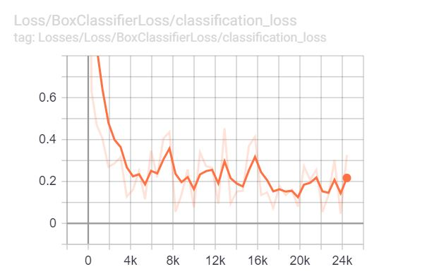
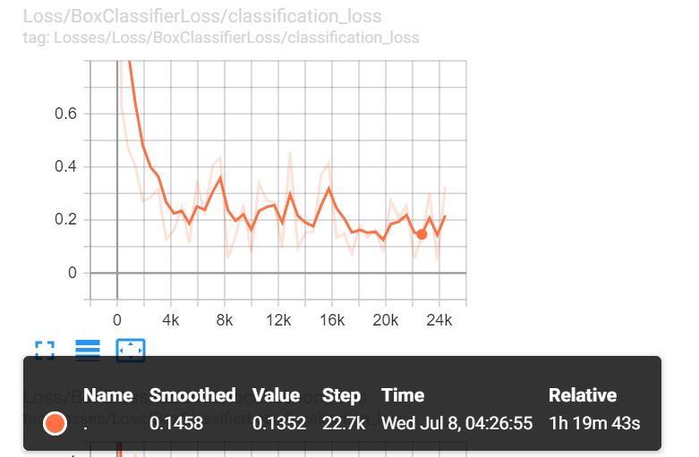
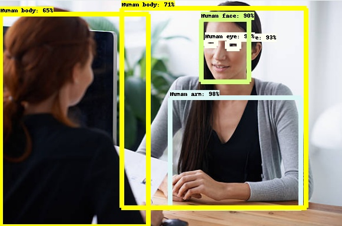
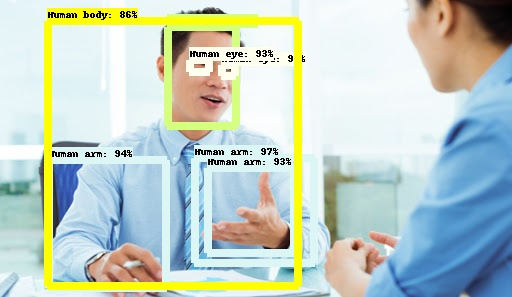
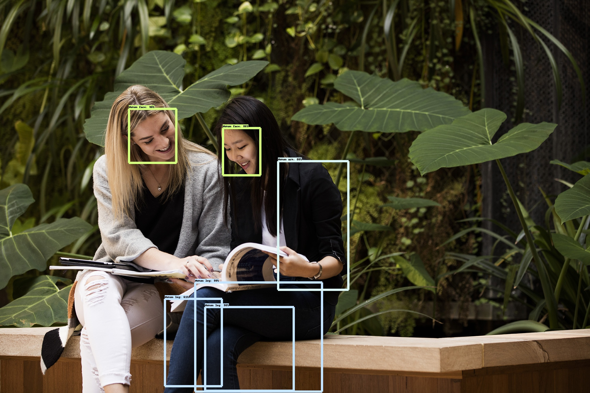

# HumanDetection

## Introduction
I've worked on the problem of human detection,face detection, eye detection. This detector is capable of detecting a human and his body parts in an image Uinsg TensorFlow's Object Detection API. Currently, it detects just the human body, face, eye, arm and legs. A new version can be developed to detect more parts and objects.   This code is written on cloud,but the general procedure can also be used for Linux or any operating systems, just file paths, package installation and environment settings will need to change accordingly.

## Requirements
<ul>
<li><b>Python3</b></li>  
<li><b>Tensorflow 1.15</b>: Download the full TensorFlow object detection repository located at https://github.com/tensorflow/models</li>  
<li><b>pre-trained classifiers</b>: TensorFlow provides several object detection models (pre-trained classifiers with specific neural network architectures) in its <a href="https://github.com/tensorflow/models/blob/master/research/object_detection/g3doc/detection_model_zoo.md">model zoo</a>. I re-trained my detector on the Faster-RCNN-Inception-V2 model, the detection worked very well, but with a noticeably slow speed. </li>
<li><b>Opencv</b> [v3]</li>  
<li><b>python libraries</b>: Here is a list of all the python dependencies
  <ul><li>tensorflow-gpu 1.15</li>
  <li>opencv-python</li>
  <li>pandas</li>
  <li>numpy</li>
  </ul>
  </ll>

</ul>
<b>note:</b> This code runs on the cloud. If you work locally, it is recommended to install Anaconda, CUDA and cuDNN. <a href="https://www.tensorflow.org/install/source#tested_build_configurations"> Here </a> is a table showing which version of TensorFlow requires which versions of CUDA and cuDNN.

## Installation
<ul>
  
  <li>After gathering or downloading the dataset. First, split the data into train and test. Then, you need to run the python txt_to_csv.py file, to convert the txt labels     files to one csv file 
  <code>
  python txt_to_csv.py
 </code> 
  This creates a train_labels.csv and test_labels.csv file in the \object_detection\images folder.
   <b>Download data processing scripts from <a href="https://github.com/galsaeedi/OIDv4_ToolKit"> my repo  </a></b>
  </li>
  
   <li>Run the python generate_tfrecord.py generate the TFRecords that serve as input data to the TensorFlow training model. Do it twice for both train and test
   <code>
  python generate_tfrecord.py --csv_input={path/to/inputcsv} --image_dir={path/to/imgdir} --output_path={path/to/outputdir}
  </code>
  </li>
  
   <li>To start train run
   <code>
  python train.py --logtostderr --train_dir={path/to/traindir} --pipeline_config_path={path/to/detector config file} --label_map_path={path/to/labelmap file}
  </code>
    </li>
  
   <li>
  View the progress of the training job using TensorBoard on Google Colab.
   <code>
  %load_ext tensorboard </code> 
  <code>%tensorboard --logdir training 
  </code> 
  </li>
  
   <li>
  Generate the frozen inference graph (.pb file).
  <code>python export_inference_graph.py  --input_type image_tensor --pipeline_config_path {path/to/detector config file} --trained_checkpoint_prefix {path/to/model.ckpt} --output_directory {path/to/outputdir}
  </code>
  </li>
  
  </ul>
  
## Performance of code
The overall loss of the classifier over time.  

I stopped the training after 22,000 steps

## Results

## To do 
<ul>
  <li>Increase the model's accuracy through: 
    <ul>
      <li>
        Increase training time. 
      </li>
      <li>
        Restructure the model. 
      </li>
    </ul> </li>
  <li>Create vedio, webcam detection scripts</li>
  
</ul>

## Thanks to:
* Evan Juras : https://github.com/EdjeElectronics/TensorFlow-Object-Detection-API-Tutorial-Train-Multiple-Objects-Windows-10
* AI Guy: https://github.com/theAIGuysCode/OIDv4_ToolKit
* datitran : https://github.com/datitran/raccoon_dataset
* And everyone who develops open source projects :) 
